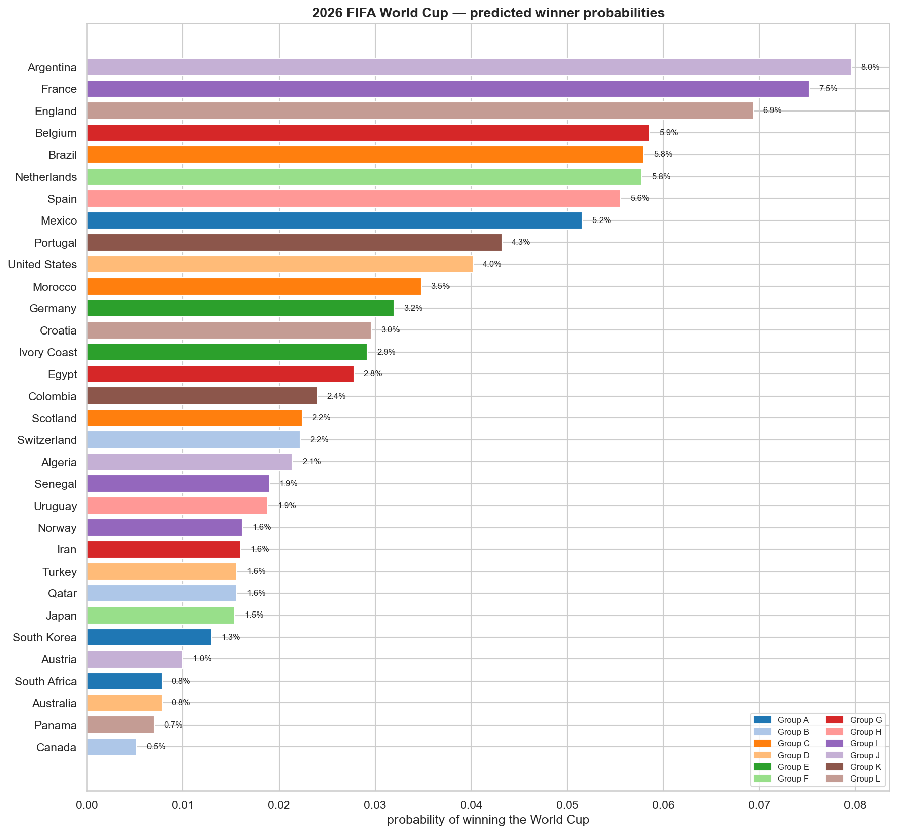
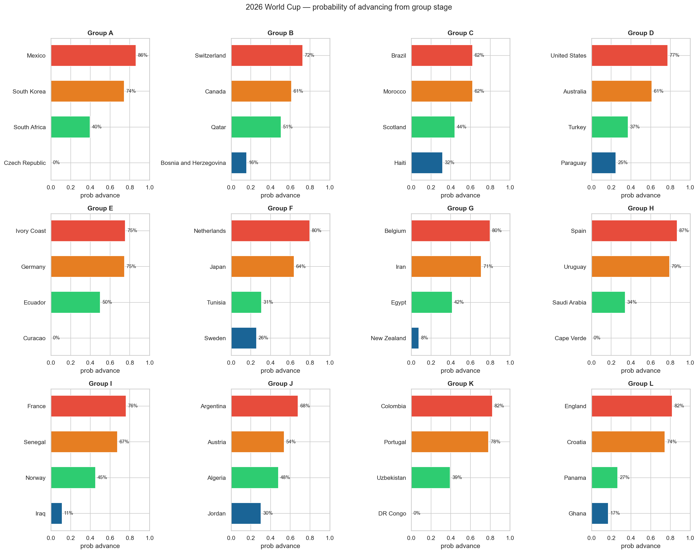

# FIFA World Cup 2026 Predictor

Machine learning project that predicts match outcomes and simulates the 2026 FIFA World Cup using historical international football results, FIFA rankings, and ELO ratings.

**Top predicted contenders:** Argentina (8.0%) → France (7.5%) → England (6.9%) → Belgium (5.9%) → Brazil (5.8%)



---

## How it works

Three models are built and compared:

**Poisson model** — predicts the number of goals each team is likely to score based on their attack and defence strength relative to the league average. Each match is simulated 10,000 times to produce win/draw/loss probabilities. Achieved 60.8% accuracy on historical matches.

**Random Forest** — ensemble of 200 decision trees trained on match features including FIFA ranking difference, FIFA points difference, ELO difference, and rolling 5-game goal averages. Achieved 59.5% accuracy.

**XGBoost** — gradient boosting model trained on the same feature set. Achieved 59.3% accuracy.

The full 2026 tournament is then simulated 5,000 times using the Random Forest model to produce win probabilities for all 48 teams.

---

## Results

### Group stage advancement probabilities


### Predicted group winners
| Group | Winner | Runner-up |
|-------|--------|-----------|
| A | Mexico | South Korea |
| B | Switzerland | Canada |
| C | Brazil | Morocco |
| D | United States | Australia |
| E | Ivory Coast | Germany |
| F | Netherlands | Japan |
| G | Belgium | Iran |
| H | Spain | Uruguay |
| I | France | Senegal |
| J | Argentina | Austria |
| K | Colombia | Portugal |
| L | England | Croatia |

---

## Project structure

```
FIFA-WorldCup-2026-Predictor/
├── data/
│   ├── raw/                         ← download CSVs here (not in git)
│   └── processed/                   ← generated by preprocessing.py
├── notebooks/
│   ├── 01_exploration.ipynb         ← data loading and visualisation
│   ├── 02_features.ipynb            ← feature engineering
│   ├── 03_poisson_model.ipynb       ← statistical baseline model
│   ├── 04_ml_models.ipynb           ← Random Forest and XGBoost
│   └── 05_predictions.ipynb         ← 2026 WC predictions and charts
├── src/
│   └── preprocessing.py             ← data cleaning and merging pipeline
├── models/                          ← saved .pkl files (not in git)
├── predictions/                     ← output CSVs and charts
├── requirements.txt
└── README.md
```

---

## Setup

```bash
# 1. clone the repo
git clone https://github.com/Anm0l-Gill/FIFA-WorldCup-2026-Predictor.git
cd FIFA-WorldCup-2026-Predictor

# 2. create and activate virtual environment
python3 -m venv venv
source venv/bin/activate

# 3. install dependencies
pip install -r requirements.txt

# 4. download datasets — see data/raw/WHERE_TO_GET_DATA.txt for links
#    place results.csv, fifa_ranking.csv, goalscorers.csv,
#    shootouts.csv, teams_elo.csv in data/raw/

# 5. run the data pipeline
python src/preprocessing.py

# 6. open jupyter and run notebooks in order
jupyter lab
```

---

## Data sources

| Dataset | Source |
|---------|--------|
| International match results (1872–2024) | [Kaggle — martj42](https://www.kaggle.com/datasets/martj42/international-football-results-from-1872-to-2017) |
| FIFA world rankings (1992–2024) | [Kaggle — cashncarry](https://www.kaggle.com/datasets/cashncarry/fifaworldranking) |
| Team ELO ratings | Private dataset |
| Group stage probabilities | Private dataset |

---

## Key findings

- `point_diff` and `rank_diff` are the strongest predictors of match outcome at 37% and 34% feature importance respectively
- Draws are the hardest outcome to predict — consistent with findings across football prediction literature
- The Poisson model slightly outperforms the ML models (60.8% vs 59.5%) because it was trained on the full 2,994 match dataset vs the ML models which required complete feature data
- Argentina and France emerge as co-favourites with 8.0% and 7.5% tournament win probability
